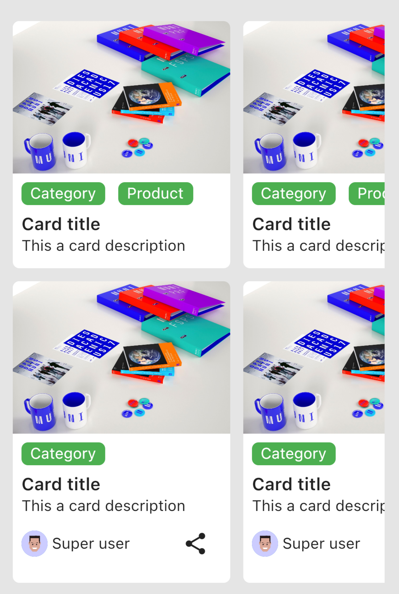

# Image Card

Customize a card with image by 2 type: fill or transparent


## Usage
### Fill image card



```dart
FillImageCard(
  width: 200,
  heightImage: 140,
  imageProvider: AssetImage('assets/mockup.png'),
  tags: [_tag('Category', () {}), _tag('Product', () {})],
  title: _title(),
  description: _content(),
),
```

### Transparent image card


```dart
TransparentImageCard(
  width: 200,
  imageProvider: AssetImage('assets/mockup.png'),
  tags: [ _tag('Product', () {}), ],
  title: _title(color: Colors.white),
  description: _content(color: Colors.white),
),
```

## Parameter

You can see parameter detail in github repo.
